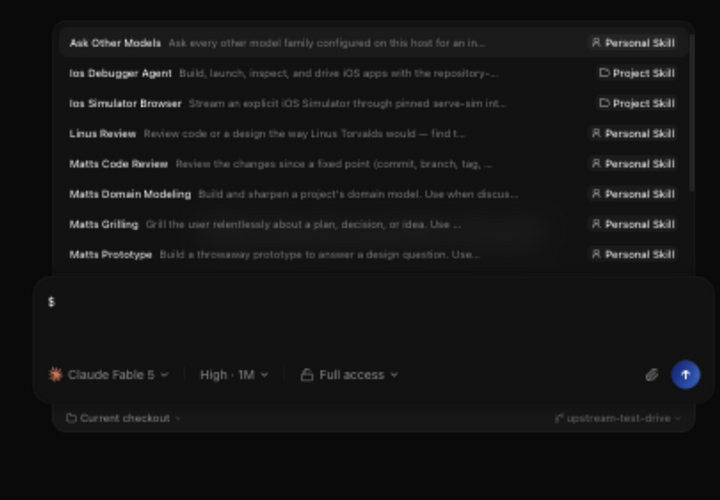
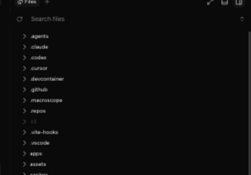
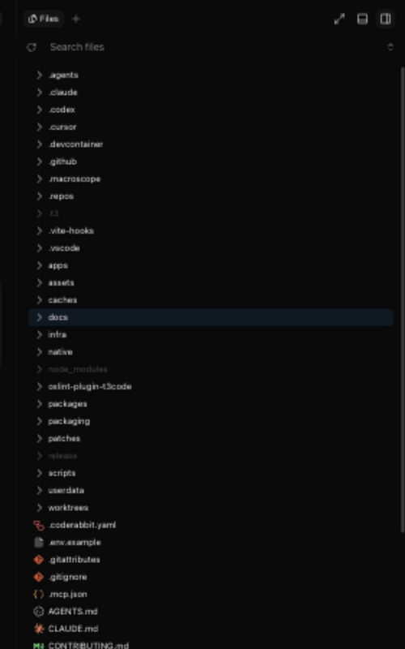

# T3 Code fork

This file tracks the behavior this fork adds on top of
[upstream T3 Code](./README.md). The fork uses the stock
**T3 Code (Alpha)** desktop identity; the differences below are product
behavior, not parallel-app branding.

This file is the canonical fork-feature record. Update it when a feature's
behavior changes, not merely when syncing with upstream.

## Grok `$` skill rewrite

Codex treats `$name` as a native invoke. Claude now does too, via upstream's
last-block `/name` dispatch (`#9128`). Grok still expands skills only from
`/name` in the prompt, so the fork rewrites composer `$name` tokens to `/name`
on Grok's wire path. The stored message keeps the `$` token.

Implementation: `packages/shared/src/composerInlineTokens.ts` and
`apps/server/src/provider/Layers/GrokAdapter.ts`.

This is a send-path rewrite and has no distinct client UI state to capture.

## Workspace-aware skills

Skill inventories are resolved per project. The server queries the selected
provider instance with the active project's directory as its working directory
instead of reusing one server-wide snapshot probed at startup. Projects with
different repo-local or nested skill sets therefore see their own inventory in
the `$` and `/` menus.

Implementation: provider skill drivers under
`apps/server/src/provider/Drivers/` and their provider layers. On mobile the
cwd-scoped catalog is consumed by the shared composer menu hook
(`apps/mobile/src/features/threads/use-composer-command-menu.ts` via
`apps/mobile/src/state/use-provider-context-skills.ts`), which retains the
last good answer so a probe refresh cannot blank an open picker; both thread
composers and the new-task draft screen share it.

The project and personal labels in the picker make the cwd-scoped inventory
visible to the user:

## Symlink-aware explorer and search

The native workspace scanner (`@ff-labs/fff-node`) does not traverse symlinks.
The fork supplements it with a cycle-safe, bounded walk that enumerates
root-level symlinks and follows symlinked directories, including targets outside
the workspace. Supplemental entries merge into the legacy whole-tree listing
and path search and obey the project's VCS ignores. The walk is capped at 5,000
entries and rebuilt when the workspace index refreshes. Search reports
truncation when unique supplemental results exceed the requested limit. The
lazy explorer follows symlinks directly as directories are expanded.
Opening a listed file uses the same workspace-relative path: `projects.readFile`
follows the link even when the target sits outside the workspace. Lexical `../`
escapes are still rejected.

Entries that are themselves symbolic links carry an optional `symlink` flag on
the `ProjectEntry` contract (omitted for regular entries; `kind` still reflects
the resolved target). The file explorer renders a small muted ↗ badge on those
rows — web/desktop through the tree's row-decoration hook, mobile next to the
row name. Descendants reached through a link are not flagged, and on web a
symlinked directory absorbed into a flattened single-child segment shows no
badge.

Implementation: `apps/server/src/workspace/WorkspaceSearchIndex.ts`,
`apps/server/src/workspace/WorkspaceFileSystem.ts`,
`packages/contracts/src/project.ts`,
`apps/web/src/components/files/FileBrowserPanel.tsx`, and
`apps/mobile/src/features/files/FileTreeBrowser.tsx`.

`CLAUDE.md` is a symlink in this checkout; the explorer marks it with the muted
arrow badge:

## Hidden-root visibility

The same supplemental walk exposes root-level dotfiles and dot-directories that
the native index omits. `.git`, `.DS_Store`, and upstream's `.convex` cache
exclusion remain hidden, as do paths ignored by the active VCS.

Implementation: `apps/server/src/workspace/WorkspaceSearchIndex.ts`.

## Lazy per-directory file explorer

Upstream's explorer fetches the whole workspace as one flat listing through
`projects.listEntries`, silently capped at 25,000 entries (directories count),
so large repos lose everything past the alphabetical cutoff. The fork loads the
explorer VS Code-style instead: a new `projects.listDirectory` RPC returns one
directory's direct children from a plain `readdir` (no search-index dependency,
no entry cap), and both the web tree and the mobile tree fetch a directory the
first time it is expanded. The tree opens fully collapsed (the VS Code
default), so only the root listing is fetched up front. Listings obey the
same hard exclusions as search: `.git`, `.DS_Store`, and `.convex` stay hidden.
All other direct children are shown even when the active VCS ignores them; an
optional `ProjectEntry.ignored` marker lets web and mobile render those rows in
a muted color without making them less interactive. A failed ignore probe
leaves rows visible and undecorated. Symlinks resolve to their target kind, and
broken links are skipped. The legacy whole-tree listing and search remain
VCS-ignore-aware; their supplemental symlink walk fails open when
`git check-ignore` rejects pathspecs beyond a symbolic link. This deliberately
follows VS Code's default split: ignored paths remain visible in the Explorer
but are omitted from path and content search. The `.git` and `.DS_Store`
exclusions also match VS Code defaults; `.convex` is a T3-specific cache
exclusion.

Watcher events and manual refresh refetch every loaded directory and diff the
results into the tree, so expansion and selection state survive. Because the
in-tree search only sees loaded rows, a bounded server path search (limit 200)
merges its matches — with synthesized ancestor directories — into the tree
while a search query is active.

Upstream's expand/collapse-all control (#8889) is adapted to lazy loading: in
lazy mode it toggles only the workspace root's direct child directories — one
bounded listing fetch per directory instead of a cascade through the whole
workspace — while legacy servers keep upstream's full-tree toggle. Collapsing
leaves nested expansion state intact, so re-expanding a folder restores the
subtree the user had open. Upstream's workspace-mutation refresh (#8803) is
disabled in lazy mode because the filesystem watcher already converges the
tree after agent edits.

Version skew: the server advertises the `workspaceDirectoryListing` capability;
clients fall back to the legacy capped `listEntries` flow against servers that
lack it. `projects.listEntries` itself is unchanged for old clients.

Implementation: `apps/server/src/workspace/WorkspaceEntries.ts`,
`packages/contracts/src/project.ts`,
`apps/web/src/components/files/useLazyFileTree.ts`, and
`apps/mobile/src/features/files/useLazyProjectEntries.ts`.

The initial root listing is collapsed, and ignored entries such as
`node_modules` remain usable but muted:

## Live filesystem updates

While a client subscribes to workspace changes, the server watches the active
workspace and pushes invalidations for changes made outside T3. The watcher is
shared by subscribers to the same resolved workspace and is released after the
last subscriber disconnects. Because `@parcel/watcher` does not follow directory
symlinks, the fork also watches discovered external symlink targets. It does not
blanket-ignore `node_modules`, because those entries can be visible in the
explorer when the project's VCS rules allow them.

Because the watcher can miss changes (unwatchable filesystems, failed
subscriptions), a manual explorer refresh — the web refresh button and mobile
pull-to-refresh — calls `projects.refreshEntries`, which rescans the workspace
index from disk and then emits a change event so every subscribed client
refetches, instead of merely re-reading the possibly stale index.

Implementation: `apps/server/src/workspace/WorkspaceWatcher.ts`, with client
query invalidation in the web and mobile `state/queries.ts` modules.

The refresh control in the explorer is the manual fallback for the same
invalidation path. A still image cannot demonstrate watcher-driven updates,
but it does show the user-visible recovery control:

## Deterministic web-client cache headers

Upstream serves the bundled web client with no `Cache-Control`, leaving
Chromium's heuristic cache to decide freshness — after a deploy, clients
could serve the previous frontend for up to an hour depending on file ages
(the "hit Cmd+R after relaunch" ritual). The static route now marks
content-hashed `assets/*` responses `public, max-age=31536000, immutable`
and everything else (`index.html`, the SPA fallback, root files)
`no-cache`, so every load revalidates the entry point and a swapped build
is picked up on the next reload, deterministically. Applies to all
surfaces the server serves: the desktop renderer (whose `t3code://app`
protocol proxies these headers through), local browsers, and remote
clients.

Implementation: `apps/server/src/http.ts` (`staticResponseCacheControl`).

This is HTTP cache behavior and has no distinct client UI state to capture.

## Tilde paths stay plain in chat

Inline-code mentions beginning with `~/` stay plain code rather than being
expanded against a home directory guessed from the thread workspace. This
avoids fabricating local links for paths mentioned on remote machines. Absolute
and relative path chips, explicit Markdown links, and image embeds are
unchanged.

Implementation: `packages/client-runtime/src/markdownLinks.ts` (inline-code
candidate) and `apps/web/src/markdown-links.ts`.

## Desktop runs a swappable server payload

When `~/.t3/fork/desktop-server-root` exists on the desktop machine, its first
non-empty, non-comment line names a directory that replaces the bundled server
tree in packaged builds. The directory must contain `apps/server/dist/bin.mjs`
(with `dist/client` inside) and a `node_modules` resolvable from its root —
the same shape as the app.asar server root. Because the web client is served
by the backend, one payload swap updates both server and frontend; only
desktop shell changes (Electron main process, natives, packaging) still need a
DMG rebuild. The file is read once at launch, `~/` expands to the home
directory, and a missing or invalid target falls back to the bundled tree, so
a stale pointer can never brick the app. Development launches ignore the file.

The payload is staged from the same npm tarball the remote hosts install
(`deploy/stage-server-payload.sh` in the wrapper repository extracts it and
runs `npm install`), so local and remote deploys share one artifact. Whether
the override took effect is observable in the backend child process's argv,
which contains the resolved entry path.

Implementation: `apps/desktop/src/main.ts` and
`apps/desktop/src/app/DesktopEnvironment.ts`.

This launch-time payload selection has no distinct client UI state to capture.

## SSH launch runs the fork server

When `~/.t3/fork/ssh-t3-package-spec` exists on the desktop machine, its first
non-empty, non-comment line is used as the npm package spec for the remote T3
runner. An explicit override is authoritative even when a global `t3` binary is
already installed remotely. Remove the file to restore upstream's normal
channel-derived package selection and global-binary preference.

Deploys are covered by `.agents/skills/DEPLOY_FORK.md` in the wrapper repository.
`deploy/pack-server-tarball.sh` builds a SHA-versioned package for the remote
host, and `deploy/swap-fork-app.sh` replaces the stock-named desktop app.

Implementation: `packages/ssh/src/command.ts`, `packages/ssh/src/tunnel.ts`, and
`apps/desktop/src/main.ts`.

This remote-launch selection has no distinct client UI state to capture.

## Claude session recovery after latched auth errors

The Claude CLI latches into a logged-out state for its whole process lifetime
when its OAuth refresh fails (typically because a concurrent Claude process
rotated the shared credentials first): every later turn short-circuits to
"Not logged in · Please run /login" even after credentials are valid again.
Upstream keeps that process alive across turns, stranding the one thread while
new threads work. The fork detects auth-error results, posts a runtime warning
to the thread, and closes the runtime so the normal teardown path emits
`session.exited`; the next message respawns the CLI, which reads the current
credentials and resumes from the persisted cursor.

Implementation: `apps/server/src/provider/Layers/ClaudeAdapter.ts`
(`isClaudeAuthErrorResult`, `handleResultMessage`).

Recovery is a transient provider-process lifecycle, so there is no stable UI
state that honestly demonstrates it in a screenshot.

## Checkpoint revert returns the prompt to the composer

Upstream's "Revert to this message" discards the target prompt outright, and a
client-side retention bug made it linger in the timeline as a ghost: user
prompts are stored with a null `turnId`, the client reducer kept all
turn-less messages after `thread.reverted` while the server projector capped
them at the reverted turn count, so the displayed prompt no longer existed in
the server read model or the provider's rolled-back context. Worse, the ghost
was durable: the client persists thread snapshots (IndexedDB on web/desktop)
and resumes subscriptions with `afterSequence`, so a cached ghost was never
corrected by a fresh snapshot — it survived app restarts indefinitely.

The fork fixes retention in the shared client reducer: turn-less messages
(user prompts carry a null `turnId`) are kept only when they predate the last
retained checkpoint's `completedAt`; anything newer sits past the revert cut.
A count-based rescue is deliberately avoided because `thread.messages` is a
paginated window while turn counts are whole-thread. The thread snapshot
cache schema version is bumped (web v4, mobile v4) so caches written before
the fix are discarded once and refetched. On the web client, the reverted
prompt's text is placed back into the composer after a successful revert for
edit-and-resend — matching the rewind UX of the Codex and Claude desktop
apps. An unsent composer draft is never overwritten, and the confirm dialog
states that the prompt will be returned.

Implementation: `packages/client-runtime/src/state/threadReducer.ts`
(`retainMessagesAfterRevert`), `apps/web/src/components/ChatView.tsx`
(`onRevertToTurnCount`, `onRevertUserMessage`),
`apps/web/src/connection/storage.ts`, and
`apps/mobile/src/connection/environment-cache-store.ts`.

## Sync status

Last synced on 2026-09-02 against upstream `d937e3075` (v0.0.38 and following
nightlies). The pre-sync fork is preserved at
`backup/upstream-test-drive-pre-sync-20260902` (`d4f79f8a9`). This sync adopted
upstream's Claude last-block `$skill` dispatch, kept the Grok `$`→`/` rewrite,
moved the tilde-path skip into the shared inline-code candidate, and adapted
the lazy explorer to upstream's incremental tree updates. The previous sync
point is preserved at `backup/upstream-test-drive-pre-sync-20260901`
(`fb5e3edd5`).
