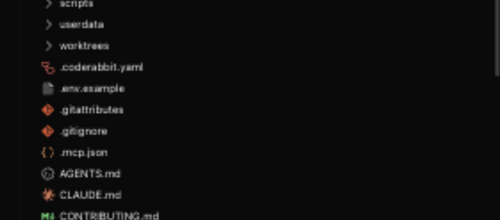
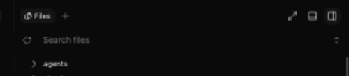
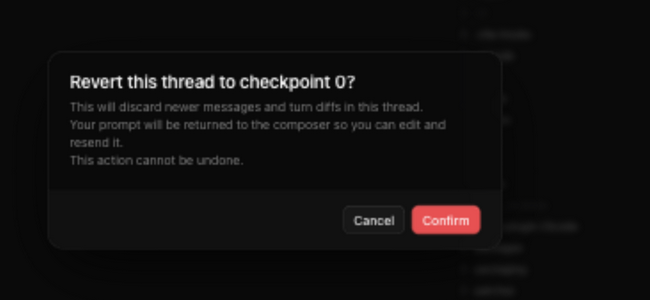

# T3 Code fork

This file tracks the behavior this fork adds on top of
[upstream T3 Code](../README.md). The fork uses the stock
**T3 Code (Alpha)** desktop identity; the differences below are product
behavior, not parallel-app branding.

This directory holds everything fork-specific that is not code:

- `README.md` (this file): the fork feature record.
- `DEPLOY_FORK.md`: deploying the fork to the local desktop app and the
  remote hosts.
- `SYNC_UPSTREAM.md`: merging upstream T3 Code into the fork.
- `deploy/`: the scripts the deploy runbook drives.
- `SHARED_CODEX.md` and `restart-codex-backend.sh`: the shared Codex desktop
  backend setup on this Mac.

This file is the canonical fork-feature record. Update it when a feature's
behavior changes, not merely when syncing with upstream. Syncing from
upstream is `fork/SYNC_UPSTREAM.md`:
every sync reassesses these entries against stock upstream and drops
deltas that are no longer needed.

## Reality check

Every feature below ends with a **Tests:** paragraph naming the tests that
prove it still works. Fork-only test files end in `.fork.test.ts` and sit
next to the module they cover, so they never collide with upstream test
files during a merge; the two tests that need a large upstream harness stay
inside `server.test.ts` and `ClaudeAdapter.test.ts` with a `fork: ` name
prefix. Run the whole fork suite from the repo root with

```
vp run test:fork
```

Run it after every upstream sync. Red means the merge is not finished:
either the fork code regressed, or the entry should have been retired and
its `.fork.test.ts` files deleted with it. A feature without a **Tests:**
paragraph is not done.

## Mermaid diagrams

Web and desktop render fenced `mermaid` blocks as diagrams in chat, Markdown
file previews, and PR descriptions. Rendering runs locally in the client and
loads Mermaid only when needed. Flowcharts default to top-to-bottom; the
direction toggle restores the original layout when preferred. This changes
only the rendered flowchart header, preserving labels, subgraph directions,
and the original source. Other diagram types keep their own layout rules.
Diagrams follow light/dark mode; wide diagrams scroll horizontally.
The Source/Diagram toggle and existing Copy code action
keep the original text available. Streaming responses show source until the
response finishes, and invalid or oversized diagrams fall back to source.
Native mobile continues to show Mermaid source using its separate native
Markdown renderer. This works with every provider and connection mode without
server or protocol changes.

Tests: `apps/web/src/lib/mermaid.fork.test.ts` renders real flowchart, sequence,
class, state, and entity relationship SVGs, checks theme separation and caching,
failure recovery, size limits, and hostile directives. SVG measurements are
stubbed because jsdom has no layout engine; this is not a visual layout test.
`apps/web/src/components/ChatMarkdown.mermaid.fork.test.ts` checks streaming,
source/diagram switching, copying source, ordinary fences, error recovery, and
stale async results after source/theme changes, and switching layout without
changing copied source. `apps/web/src/lib/mermaidLayout.fork.test.ts` covers
flowchart headers, frontmatter, comments, and preservation of other content.

## Remote host on thread cards

Upstream marks a sidebar thread row that lives on another machine with a
gray machine glyph in the branch line. The fork deals every remote
environment a color and draws its machine glyph in that color on the first
line of the card, right after the project name, so rows from different hosts
read apart at a glance without a label; the host's name stays in the row
tooltip and is read to screen readers as "Remote host: <name>". Colors are
dealt in catalog order from a fixed sequence of well-separated hues (blue,
orange, emerald, violet, rose, ...), so a host keeps its color as long as the
remotes added before it stay, and the sequence wraps after twelve hosts.
Threads on the primary environment, and on any environment that is a
desktop-local connection target (the same machine reached a second way),
carry no marker. In the hosted app there is no primary environment, so every
thread that is not desktop-local is marked.

Tests: `apps/web/src/environmentColors.fork.test.ts` covers dealing order,
stability when a later host is removed, duplicate ids, and wrap-around.
`apps/web/src/components/Sidebar.remoteHost.fork.test.ts` covers the
primary, desktop-local, remote, and no-primary cases of
`isRemoteThreadEnvironment`. The card markup itself has no render test; the
web package has no React render harness.

## Symlink-aware explorer and search

The native workspace scanner (`@ff-labs/fff-node`) does not traverse symlinks.
The fork supplements it with a cycle-safe, bounded walk that enumerates
root-level symlinks and follows symlinked directories, including targets outside
the workspace. Supplemental entries merge into the legacy whole-tree listing
and path search and obey the project's VCS ignores. The walk is capped at 5,000
entries and rebuilt when the workspace index refreshes. Search reports
truncation when unique supplemental results exceed the requested limit. The
lazy explorer follows symlinks directly as directories are expanded.
Opening a listed file uses the same workspace-relative path: `projects.readFile`
follows the link even when the target sits outside the workspace. Lexical `../`
escapes are still rejected.

Entries that are themselves symbolic links carry an optional `symlink` flag on
the `ProjectEntry` contract (omitted for regular entries; `kind` still reflects
the resolved target). The file explorer renders a small muted ↗ badge on those
rows — web/desktop through the tree's row-decoration hook, mobile next to the
row name. Descendants reached through a link are not flagged, and on web a
symlinked directory absorbed into a flattened single-child segment shows no
badge.

Implementation: `apps/server/src/workspace/WorkspaceSearchIndex.ts`,
`apps/server/src/workspace/WorkspaceFileSystem.ts`,
`packages/contracts/src/project.ts`,
`apps/web/src/components/files/FileBrowserPanel.tsx`, and
`apps/mobile/src/features/files/FileTreeBrowser.tsx`.

Tests: `apps/server/src/workspace/WorkspaceSearchIndex.fork.test.ts`
(symlinked subtrees, outside targets, nested and broken links, search and
truncation), `apps/server/src/workspace/WorkspaceFileSystem.fork.test.ts`
(reading through links that resolve outside the root),
`apps/server/src/workspace/WorkspaceEntries.fork.test.ts` (link kinds in
`listDirectory`; search stays up when `git check-ignore` rejects a pathspec
beyond a link), and `apps/mobile/src/features/files/fileTree.fork.test.ts`
(the `symlink` flag stays on the linked node). The badge rendering itself
is not unit-tested.

`CLAUDE.md` is a symlink in this checkout; the explorer marks it with the muted
arrow badge:



## Hidden-root visibility

The same supplemental walk exposes root-level dotfiles and dot-directories that
the native index omits. `.git`, `.DS_Store`, and upstream's `.convex` cache
exclusion remain hidden, as do paths ignored by the active VCS.

Implementation: `apps/server/src/workspace/WorkspaceSearchIndex.ts`.

Tests: `apps/server/src/workspace/WorkspaceSearchIndex.fork.test.ts`
(dotfiles listed; `.git` and `.DS_Store` still hidden).


## Lazy per-directory file explorer

Upstream's explorer fetches the whole workspace as one flat listing through
`projects.listEntries`, silently capped at 25,000 entries (directories count),
so large repos lose everything past the alphabetical cutoff. The fork loads the
explorer VS Code-style instead: a new `projects.listDirectory` RPC returns one
directory's direct children from a plain `readdir` (no search-index dependency,
no entry cap), and both the web tree and the mobile tree fetch a directory the
first time it is expanded. The tree opens fully collapsed (the VS Code
default), so only the root listing is fetched up front. Listings obey the
same hard exclusions as search: `.git`, `.DS_Store`, and `.convex` stay hidden.
All other direct children are shown even when the active VCS ignores them; an
optional `ProjectEntry.ignored` marker lets web and mobile render those rows in
a muted color without making them less interactive. A failed ignore probe
leaves rows visible and undecorated. Symlinks resolve to their target kind, and
broken links are skipped. The legacy whole-tree listing and search remain
VCS-ignore-aware; their supplemental symlink walk fails open when
`git check-ignore` rejects pathspecs beyond a symbolic link. This deliberately
follows VS Code's default split: ignored paths remain visible in the Explorer
but are omitted from path and content search. The `.git` and `.DS_Store`
exclusions also match VS Code defaults; `.convex` is a T3-specific cache
exclusion.

Watcher events and manual refresh refetch every loaded directory and diff the
results into the tree, so expansion and selection state survive. Because the
in-tree search only sees loaded rows, a bounded server path search (limit 200)
merges its matches — with synthesized ancestor directories — into the tree
while a search query is active.

Upstream's expand/collapse-all control (#8889) is adapted to lazy loading: in
lazy mode it toggles only the workspace root's direct child directories — one
bounded listing fetch per directory instead of a cascade through the whole
workspace — while legacy servers keep upstream's full-tree toggle. Collapsing
leaves nested expansion state intact, so re-expanding a folder restores the
subtree the user had open. Upstream's workspace-mutation refresh (#8803) is
disabled in lazy mode because the filesystem watcher already converges the
tree after agent edits; the same gate applies to upstream's file-preview
breadcrumbs menu (#8910), which still reads the legacy capped listing but no
longer forces a full index rescan on every agent turn.

Version skew: the server advertises the `workspaceDirectoryListing` capability;
clients fall back to the legacy capped `listEntries` flow against servers that
lack it. `projects.listEntries` itself is unchanged for old clients.

Implementation: `apps/server/src/workspace/WorkspaceEntries.ts`,
`packages/contracts/src/project.ts`,
`apps/web/src/components/files/useLazyFileTree.ts`,
`apps/mobile/src/features/files/useLazyProjectEntries.ts`, and
`apps/mobile/src/features/files/lazyEntriesStore.ts`.

Tests: `apps/server/src/workspace/WorkspaceEntries.fork.test.ts`
(`listDirectory` children, hard exclusions, escape rejection, ignored
markers, fail-open probe),
`apps/server/src/environment/ServerEnvironment.fork.test.ts` (the
`workspaceDirectoryListing` capability is advertised), the `fork:` seam test
in `apps/server/src/server.test.ts` (`projects.listDirectory` over the
websocket RPC), `apps/web/src/components/files/useLazyFileTree.fork.test.ts`
(listing diffs into the tree model), and
`apps/mobile/src/features/files/lazyEntriesStore.fork.test.ts` (listing
diffs and search merging) plus `fileTree.fork.test.ts` (the `ignored`
flag).

The initial root listing is collapsed, and ignored entries such as
`node_modules` remain usable but muted:


## Copy absolute path from the explorer and breadcrumbs

Right-clicking a row in the file explorer or a crumb in the file-preview
breadcrumbs offers **Copy absolute path** alongside upstream's **Copy
mention** and **Add to chat**. The breadcrumbs previously had no menu of their
own (the desktop shell showed its generic Cut/Copy/Paste menu), so they now
share the explorer's menu through one helper; the project-root crumb and
host-path crumbs for files outside the workspace offer only the absolute path,
since a mention cannot address either. The path is joined from the workspace
root with the entry's relative path, using backslashes under a Windows root.

Implementation: `apps/web/src/components/files/fileEntryContextMenu.ts`,
`workspaceAbsolutePath` in `apps/web/src/components/files/filePath.ts`, and
the right-click wiring in `FileBrowserPanel.tsx` and `FileBreadcrumbs.tsx`.

Tests: `apps/web/src/components/files/filePath.test.ts` (`workspaceAbsolutePath`
joining, root handling, absolute pass-through, Windows separators).

## Live filesystem updates

While a client subscribes to workspace changes, the server watches the active
workspace and pushes invalidations for changes made outside T3. The watcher is
shared by subscribers to the same resolved workspace and is released after the
last subscriber disconnects. Because `@parcel/watcher` does not follow directory
symlinks, the fork also watches discovered external symlink targets. It does not
blanket-ignore `node_modules`, because those entries can be visible in the
explorer when the project's VCS rules allow them.

Because the watcher can miss changes (unwatchable filesystems, failed
subscriptions), a manual explorer refresh — the web refresh button and mobile
pull-to-refresh — calls `projects.refreshEntries`, which rescans the workspace
index from disk and then emits a change event so every subscribed client
refetches, instead of merely re-reading the possibly stale index.

Implementation: `apps/server/src/workspace/WorkspaceWatcher.ts`, with client
query invalidation in the web and mobile `state/queries.ts` modules.

Tests: `apps/server/src/workspace/WorkspaceWatcher.fork.test.ts` (external
change refresh, cwd stream events, symlink-target watching, `notifyChanged`,
release after the last subscriber). The client query invalidation is wiring
and is not unit-tested.

The refresh control in the explorer is the manual fallback for the same
invalidation path. A still image cannot demonstrate watcher-driven updates,
but it does show the user-visible recovery control:



## Tilde paths stay plain in chat

Inline-code mentions beginning with `~/` stay plain code rather than being
expanded against a home directory guessed from the thread workspace. This
avoids fabricating local links for paths mentioned on remote machines. Absolute
and relative path chips, explicit Markdown links, and image embeds are
unchanged.

Implementation: `packages/client-runtime/src/markdownLinks.ts` (inline-code
candidate) and `apps/web/src/markdown-links.ts`.

Tests: `packages/client-runtime/src/markdownLinks.fork.test.ts` and
`apps/web/src/markdown-links.fork.test.ts`.


## Desktop runs a swappable server payload

When `~/.t3/fork/current` exists on the desktop machine and contains
`apps/server/dist/bin.mjs` (with `dist/client` inside) and a `node_modules`
resolvable from its root — the same shape as the app.asar server root —
packaged builds load the backend from it instead of the bundled server tree.
It is normally a symlink into `~/.t3/fork/builds/<sha>/`. Because the web
client is served by the backend, one payload swap updates both server and
frontend. A DMG rebuild is only for Electron/native/packaging runtime
changes; desktop tests and `test(…)` extracts of already-shipped override
readers stay on the payload path. `fork/deploy/choose-deploy-path.sh`
prints `payload` or `dmg`. When in doubt, payload.

The symlink path is handed to the backend supervisor unresolved, and the
supervisor respawns the backend child from that same path whenever it exits.
A deploy is therefore: retarget the symlink, terminate the backend, reload the
window — the app itself keeps running. Node resolves the entry to its real
path at spawn, so the outgoing backend keeps its own build until it exits;
the deploy scripts prune every other build only after the replacement is
verified to be mapped from the new one. A missing or
invalid target at launch falls back to the bundled tree; a target that goes
bad while the app runs makes the supervisor retry with backoff until it is
fixed. Development launches ignore the symlink.

The payload is staged from the same npm tarball the remote hosts install
(`fork/deploy/stage-server-payload.sh` extracts it into
`builds/<sha>` and runs `npm install`; `fork/deploy/swap-fork-payload.sh`
retargets the symlink and restarts the backend), so local and remote deploys
share one artifact. Which build is live is `readlink ~/.t3/fork/current`;
whether the override took effect is visible in the backend child's argv,
which contains the symlink entry path.

Implementation: `apps/desktop/src/app/DesktopForkOverrides.ts`
(`readDesktopServerRootOverride`), `apps/desktop/src/main.ts`, and
`apps/desktop/src/app/DesktopEnvironment.ts`.

Tests: `apps/desktop/src/app/DesktopForkOverrides.fork.test.ts` (override
detection returns the unresolved symlink path; missing or incomplete
payloads fall back) and `apps/desktop/src/app/DesktopEnvironment.fork.test.ts`
(the override applies to packaged builds only).

This payload selection has no distinct client UI state to capture.

## SSH launch runs the fork server

When `~/.t3/fork/ssh-t3-package-spec` exists on the desktop machine, its first
non-empty, non-comment line is used as the npm package spec for the remote T3
runner. An explicit override is authoritative even when a global `t3` binary is
already installed remotely. Remove the file to restore upstream's normal
channel-derived package selection and global-binary preference.

Deploys are covered by `fork/DEPLOY_FORK.md`.
`fork/deploy/pack-server-tarball.sh` builds a SHA-versioned package for the remote
host, and `fork/deploy/swap-fork-app.sh` replaces the stock-named desktop app.

The generated runner script also turns npm's audit and fund calls off for the
package-spec install (`npm_config_audit=false npm_config_fund=false`). The
spec is a local tarball, and npm's audit request has hung indefinitely on the
remote hosts, stacking every launch attempt behind it until the launcher's
install check timed out.

Implementation: `packages/ssh/src/command.ts`, `packages/ssh/src/tunnel.ts`,
`apps/desktop/src/app/DesktopForkOverrides.ts` (`readSshPackageSpecOverride`),
and `apps/desktop/src/main.ts`.

Tests: `packages/ssh/src/command.fork.test.ts` (override precedence and
file parsing), `packages/ssh/src/tunnel.fork.test.ts` (the runner script
tries the explicit spec before a global `t3`, and disables npm audit and
fund for the install), and
`apps/desktop/src/app/DesktopForkOverrides.fork.test.ts` (reading the
override file).

This remote-launch selection has no distinct client UI state to capture.

## Claude session recovery after latched auth errors

The Claude CLI latches into a logged-out state for its whole process lifetime
when its OAuth refresh fails (typically because a concurrent Claude process
rotated the shared credentials first): every later turn short-circuits to
"Not logged in · Please run /login" even after credentials are valid again.
Upstream keeps that process alive across turns, stranding the one thread while
new threads work. The fork detects auth-error results or upstream’s structured authentication
failure evidence, posts a runtime warning
to the thread, and closes the runtime so the normal teardown path emits
`session.exited`; the next message respawns the CLI, which reads the current
credentials and resumes from the persisted cursor.

Implementation: `apps/server/src/provider/Layers/ClaudeAdapter.ts`
(`isClaudeAuthErrorResult`, `handleResultMessage`).

Tests: `apps/server/src/provider/Layers/ClaudeAdapter.fork.test.ts` (which
results count as auth errors) and the `fork:` test in
`apps/server/src/provider/Layers/ClaudeAdapter.test.ts` (warning carries the
turn id, the turn completes, the runtime exits and the session is gone).

Recovery is a transient provider-process lifecycle, so there is no stable UI
state that honestly demonstrates it in a screenshot.

## Checkpoint revert returns the prompt to the composer

Upstream's "Revert to this message" discards the target prompt outright, and a
client-side retention bug made it linger in the timeline as a ghost: user
prompts are stored with a null `turnId`, the client reducer kept all
turn-less messages after `thread.reverted` while the server projector capped
them at the reverted turn count, so the displayed prompt no longer existed in
the server read model or the provider's rolled-back context. Worse, the ghost
was durable: the client persists thread snapshots (IndexedDB on web/desktop)
and resumes subscriptions with `afterSequence`, so a cached ghost was never
corrected by a fresh snapshot — it survived app restarts indefinitely.

The fork fixes retention in the shared client reducer: turn-less messages
(user prompts carry a null `turnId`) are kept only when they predate the last
retained checkpoint's `completedAt`; anything newer sits past the revert cut.
A count-based rescue, including upstream’s current fallback, is deliberately
avoided because `thread.messages` is a paginated window while turn counts are
whole-thread. Timestamp comparisons account for time-zone offsets. Imported
conversation history stays intact when reverting, matching upstream’s boundary. The thread snapshot
cache schema version is bumped (web v4, mobile v4) so caches written before
the fix are discarded once and refetched. On the web client, the reverted
prompt's text is placed back into the composer after a successful revert for
edit-and-resend — matching the rewind UX of the Codex and Claude desktop
apps. An unsent composer draft is never overwritten, and the confirm dialog
states that the prompt will be returned.

Implementation: `packages/client-runtime/src/state/threadReducer.ts`
(`retainMessagesAfterRevert`), `apps/web/src/components/ChatView.tsx`
(`onRevertToTurnCount`, `onRevertTimelineTurn`),
`apps/web/src/components/chat/MessagesTimeline.tsx` (`RevertUserMessageButton`),
`apps/web/src/connection/storage.ts`, and
`apps/mobile/src/connection/environment-cache-store.ts`.

Tests: `packages/client-runtime/src/state/threadReducer.fork.test.ts`
(retention after `thread.reverted`, including paginated windows),
`apps/web/src/connection/storage.fork.test.ts` and
`apps/mobile/src/connection/environment-cache-store.fork.test.ts` (v3 cache
records are rejected, v4 round-trips). Returning the prompt to the composer
is `ChatView` glue and is not unit-tested; the screenshot below is its
evidence.



## Queue follow-ups while a turn is running

Upstream send while a turn is running always steers: the follow-up is injected
into the live run. The fork keeps that as the default for Enter and Send, and
adds an explicit queue for work that should wait until the current turn
finishes.

On web and desktop, **Queue** appears next to Stop when the composer has
content during a running turn. `Cmd+Enter` on macOS / `Ctrl+Enter` on Windows
and Linux queues on an existing running thread; the same shortcut on a new
thread still starts it in the background. Queued messages render above the
composer and can be removed. The oldest item auto-sends when the thread is
idle again. The queue is client-persisted (survives reload, capped at 10) and
does not drain while the app is closed.

On mobile, Send still steers. A queue button next to Send holds the message
until the thread is idle (`holdUntilIdle` on the existing outbox). Held
messages show in the timeline as pending rows, like every other outbox
message, and can be edited back into the composer from there.

Implementation: `apps/web/src/queuedFollowUpStore.ts`,
`apps/web/src/components/chat/ComposerQueuedFollowUps.tsx`,
`apps/web/src/composer-logic.ts` (`resolveFollowUpSendIntent`),
`apps/web/src/components/ChatView.tsx` (enqueue + drain),
`apps/mobile/src/state/thread-outbox-model.ts` (`holdUntilIdle`).

Tests: `apps/web/src/queuedFollowUpStore.test.ts` (enqueue, cap, environment
clear, preview text), `apps/web/src/composer-logic.test.ts` (Mod+Enter queues
on an existing thread, falls back to send when idle, background start on a
new thread is unchanged), `apps/web/src/components/ChatView.logic.test.ts`
(drain only when idle and sendable),
`apps/web/src/components/chat/ComposerPrimaryActions.test.tsx` (Queue next to
Stop while running), `apps/mobile/src/state/thread-outbox.test.ts`
(`holdUntilIdle` waits while the thread is busy; unmarked messages still
steer).

## Fork a thread

Codex and Claude desktop let you branch a conversation; upstream T3 Code has
only "New thread on branch" (a sibling with no history) and a destructive
revert. The fork adds a real fork: a new thread that holds the source
conversation through a chosen reply and continues it with the provider's own
memory of that conversation, leaving the source untouched.

Two entry points. "Fork thread from here" sits in the hover bar of every
settled assistant reply and copies the conversation through that turn,
inclusive. "Fork thread" in the thread action menu (sidebar row, chat header,
and the mobile row menu) forks through the latest settled turn. Both are
hidden on servers without the `threadFork` capability and on threads whose
provider cannot fork natively (Cursor and Grok have no fork wired), and
disabled while a turn is running. The fork inherits the source's project,
model, runtime and interaction modes, branch, and worktree, is titled
"<source title> (fork)", and opens as soon as its history lands.

On the wire a fork is a `thread.create` with `forkedFrom: { threadId, turnId
}`. The decider rejects sources in another project and forks through a
running turn; the event keeps the provenance. The fork dispatcher adds
`forkedFrom.cutoffAt` to the dispatched command: the request time of the
first source turn after the fork turn (pending rows included), or null when
the fork turn is the source's last. Every projector copies its own rows from
the source that were created before that instant (everything, on null), plus
the turn rows through the fork turn. Until 2026-09-10 the copy reused
revert's retention rules, which assume one prompt per turn and pad the user
side by count; a Claude prompt often spans several turns (background work
finishing after the reply opens a prompt-less synthetic turn) and a prompt
sent mid-turn steers into the running one, so the padding pulled in prompts
from after the fork point. Events recorded before `cutoffAt` existed replay
under the old rules. Revert still uses those count-padded rules and has the
same latent leak; it is upstream code and was left alone.
Message, activity, and plan ids are re-minted deterministically
from the fork's id (they are global primary keys). Imported message copies retain
upstream’s `import:` marker so later reverts preserve that history. Turn ids carry over
unchanged (Codex uses them as its own), and checkpoint refs move under the
fork's namespace with the git refs copied to match, so diff and revert work
on inherited turns.

Provider continuity is lazy and per adapter. The fork dispatcher asks the
source's adapter for a seeded resume cursor and persists it on the fork's
session binding; the fork's first message consumes it, so no provider process
runs at fork time and a fork that never sends stays free. Codex seeds
`{ threadId: <source>, forkLastTurnId }` and opens with `thread/fork`
(inclusive, never falling back to a fresh thread). Claude seeds the source
session id with `forkSession` and `resumeSessionAt`; to anchor older turns the
adapter now records each completed turn's final assistant uuid in the cursor
(`turnAnchors`), which also lets rollback point the resume anchor at the
surviving turn instead of the newest message. The adapter advances that
cursor in memory, and until 2026-09-10 nothing wrote it back to the session
directory except the next `sendTurn`, a session restart, or a clean
shutdown, so the persisted cursor sat one reply behind: a thread that idled
out after its first reply could not be forked at all, and longer threads
forked from the previous reply while showing the latest one. The Claude
adapter now puts its cursor on the `turn.completed` event (an optional
`resumeCursor` payload field on the settled-turn events in
`packages/contracts/src/providerRuntime.ts`), and `ProviderService` persists
it before publishing the event, so a turn is never settled downstream with a
stale cursor on disk. Turns whose cursor was never persisted, like turns
recorded before anchors existed, can only be forked from the latest reply.
OpenCode seeds the source session with the assistant ordinal and calls
`session.fork` at that message.

Implementation: `packages/contracts/src/orchestration.ts` (`ThreadForkSource`),
`apps/server/src/orchestration/threadFork.ts` (cutoff and id rules),
`decider.ts`, `projector.ts`, `Layers/ProjectionPipeline.ts` (per-projector
copies), `Layers/ThreadFork.ts` (dispatch ordering, checkpoint ref copy),
`provider/Services/ProviderAdapter.ts` (`conversationFork` capability,
`forkThread`), `provider/Layers/{Codex,Claude,OpenCode}Adapter.ts`,
`checkpointing/CheckpointStore.ts` and `vcs/GitVcsDriver.ts`
(`copyCheckpointRefs`), `packages/client-runtime/src/state/thread-fork.ts`
(client gating and title), `apps/web/src/hooks/useForkThread.ts`,
`apps/web/src/components/chat/MessagesTimeline.tsx` (`ForkFromTurnButton`),
`apps/web/src/components/threadActionMenu.logic.ts`, and
`apps/mobile/src/features/home/useThreadListActions.ts` with the mobile row
menus.

Tests: `apps/server/src/orchestration/threadFork.fork.test.ts` (cutoff, time
cut, and deterministic ids), `decider.threadFork.fork.test.ts` (fork-point
checks), `projector.threadFork.fork.test.ts` (command read model copy),
`Layers/ProjectionPipeline.threadFork.fork.test.ts` (SQL projections, turn
refs, shell summary; both projector tests cover the time cut keeping steered
and prompt-less turns while dropping the next prompt, and imported history
surviving a fork and subsequent revert), `apps/server/src/provider/Layers/CodexSessionRuntime.fork.test.ts`
(`thread/fork` open path, no fallback), `ClaudeAdapter.fork.test.ts` (seed
cursor, anchors, and the fork-point error wording), `ClaudeAdapter.test.ts`
(the settled turn's `turn.completed` carries the anchored cursor),
`ProviderService.test.ts` (that cursor is persisted when the turn settles),
`OpenCodeAdapter.fork.test.ts` (seed cursor),
`apps/server/src/environment/ServerEnvironment.fork.test.ts` (capability),
`packages/client-runtime/src/state/thread-fork.fork.test.ts` (client gating),
`apps/web/src/components/threadActionMenu.logic.fork.test.ts`, and
`apps/mobile/src/features/threads/thread-fork-menu.fork.test.ts` (menu items).
The end-to-end dispatch path (`Layers/ThreadFork.ts`) and the adapters'
session-start consumption of the seeded cursors spawn real providers and are
not unit-tested.

## Repository directory per checkout

A project can name a **Repository directory** other than its root, under the
Checkout section of Settings → Projects. The motivating layout is a meta
workspace: a directory of symlinks that gathers several sources, whose real
repository is one child. Commits, branches, pull requests, worktrees,
checkpoints, repository identity, and auto-pull run there; agents, file
search, the Open button, and project actions keep the project root. The
setting is per checkout and never fans out over a project group. Relative
input resolves against the project root on the client; the server stores
only an absolute, existing directory. Mobile follows the setting but cannot
edit it.

Implementation: `vcsRoot` on the project contract and the meta-update
command (`packages/contracts/src/orchestration.ts`), migration
`050_ProjectionProjectsVcsRoot` (live databases have applied id 50 under this
name, so upstream migrations numbered 50 and above are renumbered one higher
in the fork; see `fork/SYNC_UPSTREAM.md`), the resolver in
`packages/shared/src/projectVcs.ts` with the server twin
`resolveThreadVcsCwd` in `apps/server/src/checkpointing/Utils.ts`, and the
settings row in `apps/web/src/components/settings/ProjectSettingsPanel.tsx`.
`getActiveProjectByWorkspaceRoot` matches either root because git-facing
callers only know the cwd they ran in. The checkpoint reactor prefers the
thread's VCS cwd over the live session cwd only when a VCS root is set.

Tests: decider, projection pipeline, snapshot lookup, normalizer
(`Normalizer.vcsRoot.test.ts`), migration, shared resolver, the web path
input, and a `CheckpointReactor` case where the agent runs in a meta
workspace and checkpoints land in the child repository.

## Sync status

Last synced on 2026-09-11 against upstream `211618fd9`
(v0.0.41-nightly.20260911.1520 plus 17 commits). The pre-sync fork is preserved
at `backup/upstream-test-drive-pre-sync-20260911` (`741cb2aae`). Every
feature entry remains needed. This sync renumbered upstream's migration 050 to
051 behind the fork's VCS-root migration, dropped the fork's mobile queued
list in favour of upstream's pending rows in the timeline, moved the sidebar
rows and the mobile branch checkout onto upstream's project-record helpers,
routed upstream's new pull-request stack read through the VCS root, and
renamed the fork's tagged errors for the Effect rc.112 upgrade. The previous
sync point is preserved at `backup/upstream-test-drive-pre-sync-20260907`
(`9b3ad29b0`).
